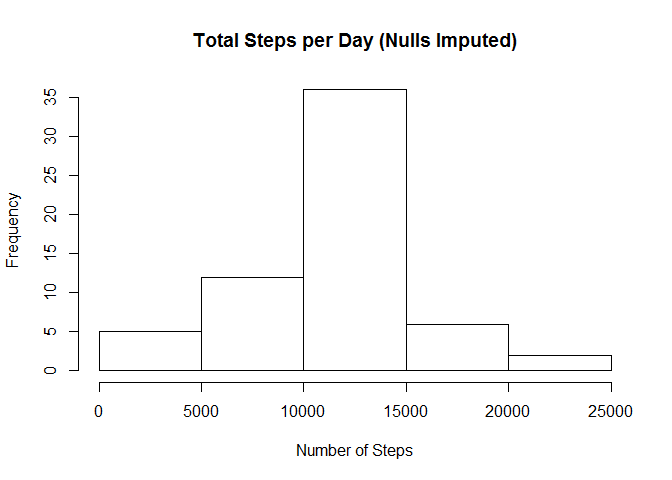
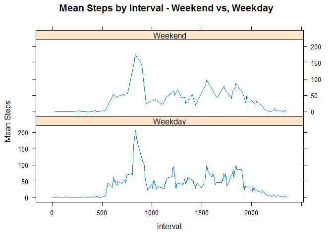

---
output:
  html_document:
    keep_md: yes
---
# Reproducible Research - Step Activity Analysis 

Monitoring devices (Fitbit, Nike Fuelband, Jawbone Up) collected step data at 5 minute intervals through out the day between October and November, 2012.  It includes the number of steps taken in 5 minute intervals each day.  Results of the analysis are included below.


```r
### read file and set libraries
activity <- read.csv("activity.csv")

library(timeDate)
library(plyr)
library(lattice)
library(dplyr)
```


Graph of steps per day


```r
## histogram sums steps by date
stepsbydate <- aggregate(activity$steps, by = list(date = activity$date), FUN = sum)
hist(stepsbydate$x, main = "Total Steps per Day", xlab = "Number of Steps")
```

 


Mean daily steps


```r
mean(stepsbydate$x, na.rm = TRUE)
```

```
## [1] 10766.19
```


Median daily steps


```r
median(stepsbydate$x, na.rm = TRUE)
```

```
## [1] 10765
```


Plot of mean steps per interval


```r
## mean and max steps for each interval period
GroupByInterval <- group_by(activity, interval)
## mean number of steps per interval
MeanStepsByInterval <- summarise(GroupByInterval, AvgSteps = mean(steps, na.rm = TRUE))
plot(MeanStepsByInterval, type = "l", main = "Mean Steps by Interval", xlab = "Interval", ylab = "Mean Steps")
```

 


Interval with largest number of steps


```r
## ranks average number of steps and gets largets number and associated interval
LargestInterval <- MeanStepsByInterval[rank ( order( -MeanStepsByInterval$AvgSteps, MeanStepsByInterval$interval )) , ]
LargestInterval[1 ,]
```

```
## Source: local data frame [1 x 2]
## 
##   interval AvgSteps
## 1      835 206.1698
```


Count of records with NA values


```r
## finds number of nulls
sum(is.na(activity))
```

```
## [1] 2304
```


Impute NA values with the overall mean for that 5 minute interval


```r
## replaces NA with interval mean
impute.mean <- function(x) replace(x, is.na(x), mean(x, na.rm = TRUE))
activityNoNull <- ddply(activity, ~ interval, transform, steps = impute.mean(steps))

## gets sum of steps by day for data with imputed values
stepsbydateNoNull <- aggregate(activityNoNull$steps, by = list(date = activityNoNull$date), FUN = sum)
hist(stepsbydateNoNull$x, main = "Total Steps per Day (Nulls Imputed)", xlab = "Number of Steps")
```

 


Get means and medians for data with imputed values


```r
mean(stepsbydateNoNull$x)
```

```
## [1] 10766.19
```

```r
median(stepsbydateNoNull$x)
```

```
## [1] 10766.19
```


The results are nearly identical to those of the data with nulls.  The datasets are not significantly different from each other


Plot step data by interval and compare weekday and weekend results


```r
## creates weekend factor variable
activityNoNull$isWeekend <- isWeekend(activityNoNull$date)
activityNoNull$isWeekend.f <- factor(activityNoNull$isWeekend, labels = c("Weekday", "Weekend"))

## gets means for interval step data
GroupByIntervalNoNull <- group_by(activityNoNull, interval, isWeekend.f)
MeanStepsByIntervalNoNull <-ddply(GroupByIntervalNoNull, ~ interval, summarise, mean = mean(steps))

xyplot(mean ~ interval | activityNoNull$isWeekend.f, data = MeanStepsByIntervalNoNull, type = "l", 
    main = "Mean Steps by Interval - Weekend vs, Weekday", 
    ylab = "Mean Steps",  
    layout=c(1,2))
```

 
